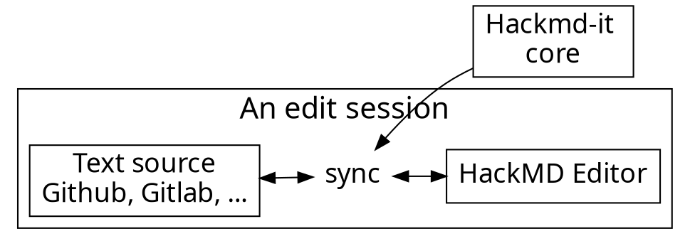

# Python modules system

<!-- Put the link to this slide here so people can follow -->
slide: https://hackmd.io/W_rKVn7yQaiLSkZi0BKX3Q

---


## Rules & Restrictions

- Python 2 is dead
- All the information may be incomplete
- Documentation is the source of truth if you're in doubt:
    - [modules](https://docs.python.org/3/tutorial/modules.html?highlight=modules)
    - [import system](https://docs.python.org/3/reference/import.html#importsystem)
- If you have time, take a look at [David Beazley's extensive tutorial](http://www.dabeaz.com/modulepackage/) on this topic
    - I've taken a lot from that slides

---

## Basic "gold" path

----

### Modules

- Any Python source file is a module
```python3
#spam.py

def grok(x):
    ...
    
def blah(x):
    ...
```

- You use import to execute and access it

```python3
import spam

a = spam.grok('hello')

from spam import grok

a = grok('hello')
```

----

### Namespaces

- Each module is its own isolated world

```python3 
#spam.py
x = 42

def blah():
    print(x)
    
    
# eggs.py
x = 37

def foo():
    print(x)
```

- What happens in a module, stays in a module

----

### Global Variables

- Global variables bind inside the same module
```python3
# spam.py

x = 42
def blah():
    print(x)
```

- Functions record their definition environment

```
>>> from spam import blah
>>> blah.__module__'spam'
>>> blah.__globals__{ 'x': 42, ... }
```

----

### Module Execution
- When a module is imported, all of the statements in the module execute one after another until the end of the file is reached
- The contents of the module namespace are all of the global names that are still defined at the end of the execution process
- If there are scripting statements that carry out tasks in the global scope (printing, creating files, etc.), you will see them run on import
    - *This it why I insist on wrapping code into functions/classes*

----

### from module import
- Lifts selected symbols out of a module after importing it and makes them available locally
```python3
from math import sin, cos

def rectangular(r, theta):
    x = r * cos(theta)
    y = r * sin(theta)
    return x, y
```

- Allows parts of a module to be used without having to type the module prefix

----

### from module import *

- Takes all symbols from a module and places them into local scope

```python3
from math import *

def rectangular(r, theta):
    x = r * cos(theta)
    y = r * sin(theta)
    return x, y
```

- Sometimes useful
- Usually considered bad style (try to avoid)

----

### However, 

- variations on import do not change the way that modules work
```python3 
import math as m
from math import cos, sin
from math import *
...
```
- import always executes the entire file
- modules are still isolated environments
- these variations are just manipulating names

----

### Module Names
- File names have to follow the rules
    - Yes: `good.py`
    - No: `2bad.py`
- Must be a valid identifier name
- Also: avoid non-ASCII characters

----

### Naming Conventions
- It is standard practice for package and module names to be concise and lowercase
    - Yes: `foo.py`
    - No: `FooModule.py`
- Use a leading underscore for modules that are meant to be private or internal
    - `_private_foo.py`
- Don't use names that match common standard library modules (confusing)
    - `projectname/math.py`

----

### Module Search Path

- If a file isn't on the path, it won't import:
```
>>> import sys
>>> sys.path
['', '/usr/lib/python36.zip', '/usr/lib/python3.6',
 '/usr/lib/python3.6/lib-dynload',
 '/home/grigory/.local/lib/python3.6/site-packages',
 '/usr/local/lib/python3.6/dist-packages',
 '/usr/lib/python3/dist-packages']
```
- Sometimes you might hack it
```python3
import sys
sys.path.append("/project/foo/myfiles")
```
... although doing so feels "dirty"

----

### Module Cache
- Modules only get loaded once
```
>>> import spam
>>> import sys
>>> 'spam' in sys.modules
    True
>>> sys.modules['spam']
    <module 'spam' from 'spam.py'>
```
- There's a cache behind the scenes
- Consequence:  If you make a change to the source and repeat the import, nothing happens

----

### Module Reloading
- You can force-reload a module, but you're never supposed to do it
```
>>> from importlib import reload
>>> reload(spam)
    <module 'spam' from 'spam.py'>
```
- Modules reloading is dangerous! Lots of things can go wrong.

----

### Modules Reloading for Notebooks

- There is one special case when modules reloading is very useful and almost unescapable: coding in jupyter notebooks

```
% load_ext autoreload
% autoreload 2
```

- These two commands at the begging of the notebook will auto-reload your external modules on any change in them
    - Please read the documentation on autoreload module first!

----

### `__main__` check
- If a file might run as a main program, do this:
```python3
# spam.py

...

if __name__ == '__main__':    # Running as the main program
    ...
```
- Such code won't run on library import

```python3 
import spam  # Main code doesn't execute
```
```bash
python spam.py   # Main code executes
```

----

### Packages
- For larger collections of code, it is usually desirable to organize modules into a hierarchy

```
.
├── bar
│   └── grok.py
└── spam
    └── foo.py
```

- To do it, you just add `__init__.py` files
```
.
├── bar
│   ├── grok.py
│   └── __init__.py
└── spam
    ├── foo.py
    └── __init__.py
```

----

### Using a Package

- Import works the same way, multiple levels
```python3
import spam.foo
from spam.bar import grok
```
- The `__init__.py` files import at each level
- Apparently you can do things in those files
- These things should relate to the proper importing
- Placing logic in `__init__.py` files is considered as a bad practice.

----

### Summary

- It looks that there is not that much going on in the modules & packages, and in the import system
- Why it is considered to be complex?
- Let's continue beyound the "gold" path 

---

## Glossary for organizing python code

----

### Module 
- An object that serves as an organizational unit of Python code. Modules have a namespace containing arbitrary Python objects.
- Examples: a single `.py` file, a directory with python files / subdirectories

----

### Package

- A Python module which can contain submodules or recursively, subpackages. Technically, a package is a Python module with an `__path__` attribute.

----

### Regular package
- A traditional package, such as a directory containing an `__init__.py` file.

----

### Namespace package
- A PEP 420 package which serves only as a container for subpackages. Namespace packages may have no physical representation, and specifically are not like a regular package because they have no `__init__.py` file.

---

### Wait, what?!

- You mean that if I miss that stupid `__init__.py` file I'll get another type of package?
- Yes! And what's even worse, these two types of packages work differently!


## What is namespace package and how to live without `__init__.py`
## What are the PYTHONPATH, sys.path and other guys?
## Absolute imports vs relative ones
## Imports done right
## How to avoid import errors on calling the script from inside the project
## Two types of calling python scripts (direct vs -m)

## How to write setup.py script in a simple case
## Managing dependencies
## Collecting dependencies if they are not provided (automatic script)
## Pip freeze
## Pip & requirements.txt
## Poetry

---




---

### Architecture of extension

---


---

## Content script

- Bind with each page
- Manipulate DOM
- Add event listeners
- Isolated JavaScript environment
  - It doesn't break things

---

# :fork_and_knife: 

---

<style>
code.blue {
  color: #337AB7 !important;
}
code.orange {
  color: #F7A004 !important;
}
</style>

- <code class="orange">onMessage('event')</code>: Register event listener
- <code class="blue">sendMessage('event')</code>: Trigger event

---

# :bulb: 

---

- Dead simple API
- Only cares about application logic

---

```typescript
import * as Channeru from 'channeru'

// setup channel in different page environment, once
const channel = Channeru.create()
```

---

```typescript
// in background script
const fakeLogin = async () => true

channel.answer('isLogin', async () => {
  return await fakeLogin()
})
```

<br>

```typescript
// in inject script
const isLogin = await channel.callBackground('isLogin')
console.log(isLogin) //-> true
```

---

# :100: :muscle: :tada:

---

### Wrap up

- Cross envornment commnication
- A small library to solve messaging pain
- TypeScript Rocks :tada: 

---

### Thank you! :sheep: 

You can find me on

- GitHub
- Twitter
- or email me
